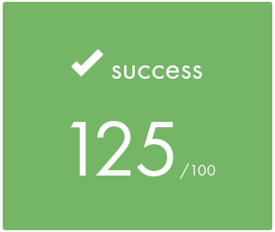

# <div align="center">⚙️ libft (a [42](https://42perpignan.fr/) project) ⚙️</div>

**libft** is the first project for 42 School.

It consisted in creating a library with some standard functions that we can use in future projects.
Some functions aim to reproduce the behaviour of existing functions from the libC ; other functions like ft_split don't exist directly in the libC but can be useful for several purposes. The bonus part of the subject constisted in creating functions to manipulate linked lists (you can find the structure in the [header file](https://github.com/Arawyn42/42_libft/blob/master/libft.h)).

**The libft includes the following functions :**

# libC functions:
- ft_atoi.c
- ft_bzero.c
- ft_calloc.c
- ft_isalnum.c
- ft_isalpha.c
- ft_isascii.c
- ft_isdigit.c
- ft_isprint.c
- ft_memchr.c
- ft_memcmp.c
- ft_memcpy.c
- ft_memmove.c
- ft_memset.c
- ft_strchr.c
- ft_strdup.c
- ft_strlcat.c
- ft_strlcpy.c
- ft_strlen.c
- ft_strncmp.c
- ft_strrchr.c
- ft_tolower.c
- ft_toupper.c

# Custom functions:
- ft_itoa.c
- ft_putchar_fd.c
- ft_putendl_fd.c
- ft_putnbr_fd.c
- ft_putstr_fd.c
- ft_split.c
- ft_striteri.c
- ft_strjoin.c
- ft_strmapi.c
- ft_strnstr.c
- ft_strnstr.c
- ft_strtrim.c
- ft_substr.c


# Bonus functions:
- ft_lstadd_back.c
- ft_lstadd_front.c
- ft_lstclear.c
- ft_lstdelone.c
- ft_lstiter.c
- ft_lstlast.c
- ft_lstmap.c
- ft_lstnew.c
- ft_lstsize.c

# How to use ?
In a bash terminal, type the following commands:
```bash
  git clone https://github.com/Arawyn42/42_libft
  cd 42_libft
  make
  make clean
```
This created the .a file, named **libft.a**

You can now compile your program using the libft, with the following command:
(Replace CC with your compiler, -FLAGS with your compilating flags, and PROG_NAME with the name of your program)

```bash
  CC -FLAGS main.c libft.a -o PROG_NAME
```

# Score obtained

